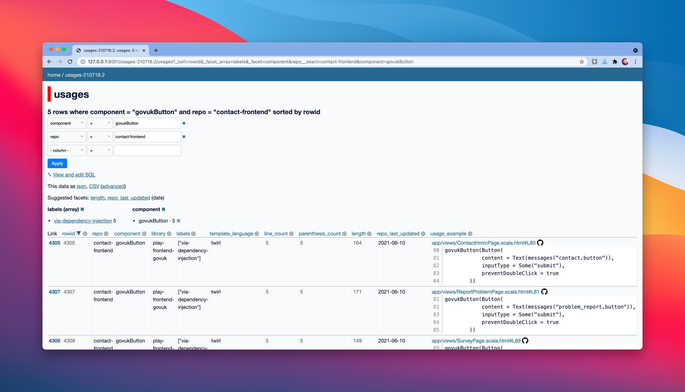

# Find Usages

Find example usages of our frontend twirl components in dependent repositories.

Allow us to make better informed choices in the maintenance of our libraries.

Output usages we find as newline delimited json that will be:

- easy to archive to let us compare changes between snapshots over time
- easy to explore with tools like Datasette
- easy to transform with tools like JQ and sqlite-utils
- easy to stream (useful when generating and when piping for analysis)

## How to use

Main supported use case is via the `find-usages` command line program provided by this repository.

Example help output when run within a `poetry shell` (Poetry is a Python packaging and dependency management system. Running poetry shell in the project root sets up the correct paths within your terminal session to be able to call scripts and dependencies provided by this project.)

```
$ find-usages
usage: find-usages [-h] [--component NAME] [--components FILE] [--output-file FILE] [--output-sqlite FILE] [--output-sqlite-table TABLE] search_path
find-usages: error: the following arguments are required: search_path
```

To get started quickly you can search against fixtures to see the expected output (see the system requirements below for what else is required before trying this yourself)

```
find-usages fixtures/via_all_methods
```

Example line of output that has been pretty printed over multiple lines for readability:

```json
{
  "repo": "example-frontend-1",
  "component": "govukButton",
  "library": "play-frontend-govuk",
  "labels": [
    "via-dependency-injection"
  ],
  "template_language": "twirl",
  "line_count": 1,
  "parenthesis_count": 2,
  "length": 35,
  "repo_last_updated": "0000-00-00 00:00:00 +0000",
  "usage_example": {
    "github_url": "https://github.com/hmrc/example-frontend-1/blob/:commit/oneline.scala.html#L5-L5",
    "line_number": 5,
    "code": "govukButton(Button(label=\"submit\"))",
    "path": "oneline.scala.html"
  },
  "code": "govukButton(Button(label=\"submit\"))",
  "path": "oneline.scala.html"
}
```

### Usage requirements

To use this tool you will need to have a local directory with all the repositories you want to search across checked out as immediate subfolders.

This can be done via a script, but that is not provided at the moment as part of this repository.

### System requirements

This tool is built with Python, you will need to have version 3.8 or later and the package manager Poetry to manage installation.

Searches themselves require ripgrep, datamash, jq, and findutils (for xargs) be installed on your system.

A nix shell file has been provided which has the complete list of dependencies and when executed with `nix-shell` can setup a local environment with everything installed. Find out more about nix-shell at https://nixos.org/.

With nix installed, to start a local environment you can run:
```
$ nix-shell
$ poetry install
$ poetry shell
```

Then you will have access to `find-usages`, `datasette`, and everything in the nix shell file.

Alternatively, if you install the required tools via your system package manager of choice, you should then only need to run the two poetry commands.

## Running the tests

In the fixtures folder you can find folders of source code and a corresponding `*.out` file with the expected stdout we would get from running `find-usages fixtures/<name>`

Automated tests can check the actual output of a search of a fixture against the expected output:

```
$ pytest
```

### Regenerating expected fixture output

If you make an intentional change to the output then rather than updating the expected fixture outputs manually, you can pass the `--bless` parameter to pytest and it will update them for you.

## Exploring what we find with datasette



To explore the usages we find we can use datasette, it's listed as a dependency so when you run `poetry install` and `poetry shell` it's available on the command line.

To run datasette we need the usages we found loaded into a sqlite database. You output the usages directly into a sqlite database with the `--output-sqlite` option, a full example using the fixtures is:

```
$ find-usages fixtures/via_all_methods --output-sqlite usages.db
```

After running that command successfully, you will have a usage.db file which is your sqlite database. You can check that the usages were inserted correctly by listing the rows with `sqlite-utils`:

```
$ sqlite-utils rows usages.db usages
```
> by default the usages are insterted in to the "usages" table, which corresponds to the last positional parameter listed in the example above.

If you need more flexibility, then you can use sqlite-utils directly, for example:

```
$ find-usages fixtures/via_all_methods | sqlite-utils insert usages.db usages - --nl
```

Then to use start datasette and you can run:

```
$ datasette usages.db --open --plugins-dir datasette/plugins --metadata datasette/metadata.yml --static static:datasette/static/ --memory
```

This will open your browser to datasette web interface, to see the main UI click into the usages database and then table, [find more information about what datasette can do](https://datasette.io/for/exploratory-analysis)